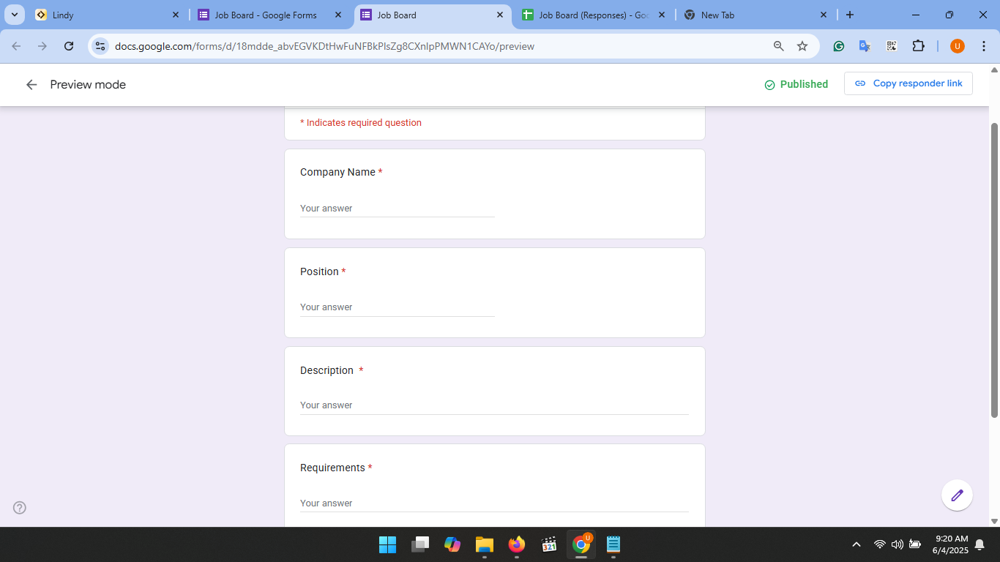
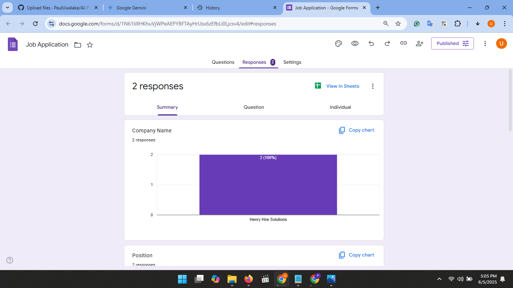
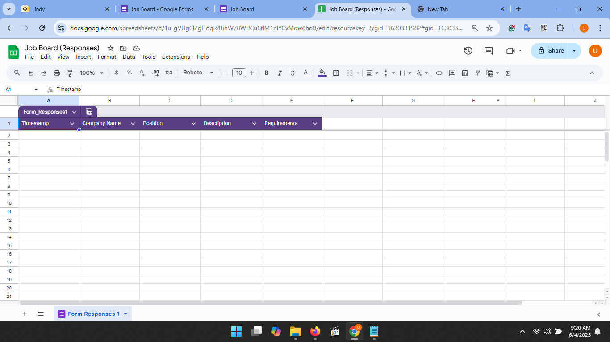
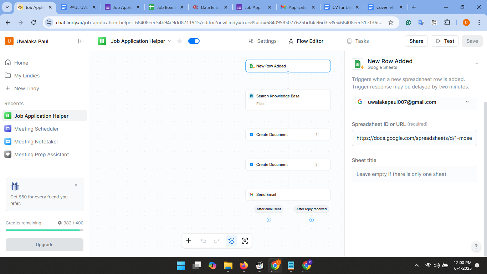
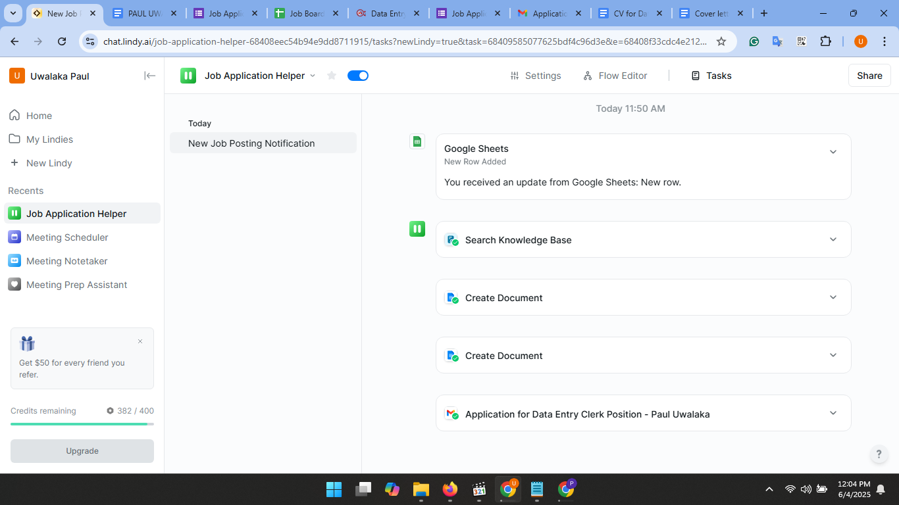
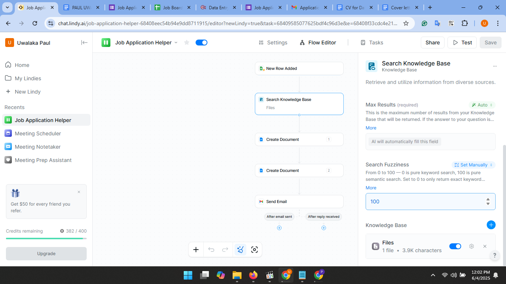
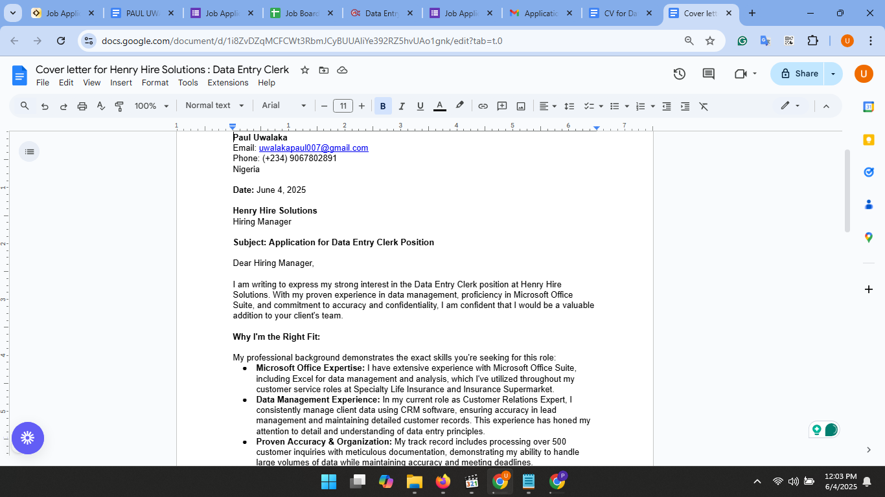

# AI-Powered-Job-Application-Automation-Workflow
This project presents an end-to-end automation workflow designed to streamline the job application process significantly. By intelligently leveraging AI and various web services, it transforms manual, time-consuming tasks into an efficient, automated pipeline for job seekers.
## Problem Statement
Navigating today's competitive job market often involves repetitive and time-consuming tasks, such as manually identifying suitable roles, extracting critical information, tailoring resumes and cover letters, and meticulously tracking each application. This manual burden can lead to missed opportunities, inconsistent applications, and applicant fatigue.
## Solution & Approach
To tackle these challenges, I developed an AI-powered automation workflow that automates key stages of the job application process. This solution integrates form-based data capture, smart spreadsheet management, and an AI agent(LindyAI) equipped with a personal knowledge base to dynamically generate highly personalized application content
## Workflow Architecture & Tools Used
My workflow is built upon a robust architecture, integrating several tools to create a seamless automation pipeline:
### Phase 1: Job Opportunity Input & Central Data Management
* **Google Forms:**
* Used to create a structured "Job Board" input form. This form captures essential job details like "Job Title," "Company Name," "Job Description," and "Requirements."
* Ensures consistent and easy data entry for new job opportunities.
*  **Google Sheets:**
*  Serves as the central data repository, automatically collecting and organizing all submissions from the Google form.
*  Acts as the primary trigger source for the entire AI automation.
*  Centralizes job data and initiates the next phase of automation.
### Phase 2: AI Automation Trigger & Core AI Agent Setup 
* **LindyAI:**
* Functions as the core AI agent and automation platform.
* Configured to monitor the Google sheet for new row additions (new job entries).
* Orchestrates the subsequent AI-driven tasks based on predefined automation flows.
* Acts as the brain of the operation, initiating content generation.
* **Google Drive:**
* Integrates with LindyAI to host my knowledge base (specifically my CV/resume).
* Provides the AI agent with personalized context for tailoring application materials.
### Phase 3: AI-Powered Text Content Generation & Customization
* **LindyAI (AI Agent):**
* Leverages its integrated language models and my CV knowledge base.
* Analyzes the specific job description and requirements from the Google sheet.
* Generates highly personalized textual content, such as tailored cover letters and optimized responses.
* Produces customized application documents, saving significant manual effort.
## Key Features & Functionality
* **Automated Job Data Capture:** Streamlined input of job opportunities via a custom Google Form, eliminating manual data entry.
* **Dynamic Workflow Triggering:** New job entries automatically activate the AI-powered automation sequence in real-time.
* **Personalized Content Generation:** Leverages AI (LindyAI) and a custom knowledge base (my CV) to create unique, job-specific cover letters and other application materials.
* **Efficiency Enhancement:** Dramatically reduces the time and effort required for tailoring applications, allowing for a broader and more focused job search.
* **Centralized Data Management:** Maintains an organized record of all applied jobs and their details.
* ## Visual Evidence & Demonstration
To illustrate the workflow in action, here are key screenshots from each phase. For a full dynamic demonstration, please watch the video.
### Setup & Data Input:
* **Job Board Google Form:**
   
    *Depicts the initial form used for collecting job details.*
* **Google Form Linked to Sheet:**
    
    *Shows how the form automatically populates the Google Sheet.*
* **Job Board Google Sheet:**
    
    *Displays the collected job data within the spreadsheet.*
### AI Automation Configuration (LindyAI):
* **LindyAI New Automation:**
    
    *Initiating the automation flow in LindyAI.*
* **Google Sheets Trigger Setup:**
    
    *Configuring the 'New Row Added' trigger from Google Sheets.*
* **CV Knowledge Base Integration:**
    
    *Added the CV from Computer as a knowledge source for the AI*
### AI Output Example:
* **Generated Cover Letter/Output:**
    
    *A sample of the personalized cover letter generated by LindyAI*
